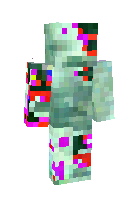
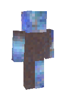
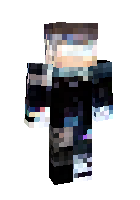
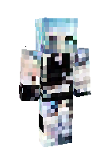

# Minecraft Skin Generator

[WIP] Simple diffusion model for generating Minecraft skins. It's built using PyTorch and is trained on a large dataset of 900k+ Minecraft skins.

First run:
trained for 50 epochs on 10k images.

Second run:
trained for 50 epochs on 200k images.

Third run:
trained for 50 epochs on 800k images.

## To test:
- [x] Increase training set size (test on 800k)
- [x] Sample generation at training checkpoints
- [ ] Limit the training set to high-quality skins only
- [ ] Increase the model's capacity: n_feat: 64 → 128 
- [ ] Finer denoising: timesteps: 500 → 1000
- [ ] Self-attention blocks at 16×16 resolution
- [ ] Better noise schedule: cosine schedule
- [ ] Smooth weights update: EMA

## Visualizing Samples
